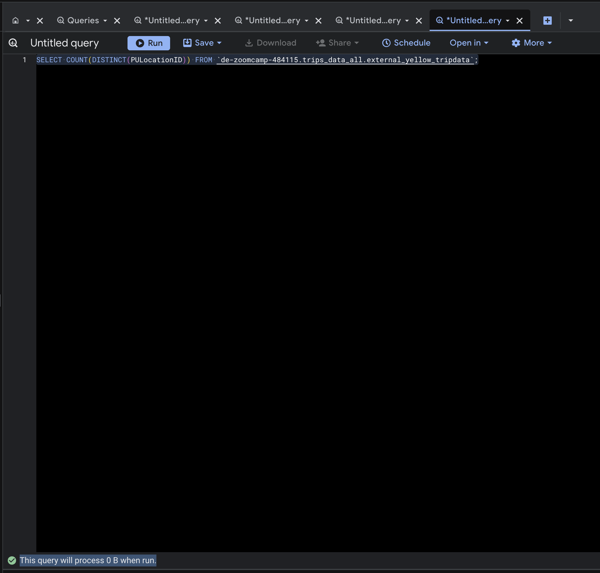
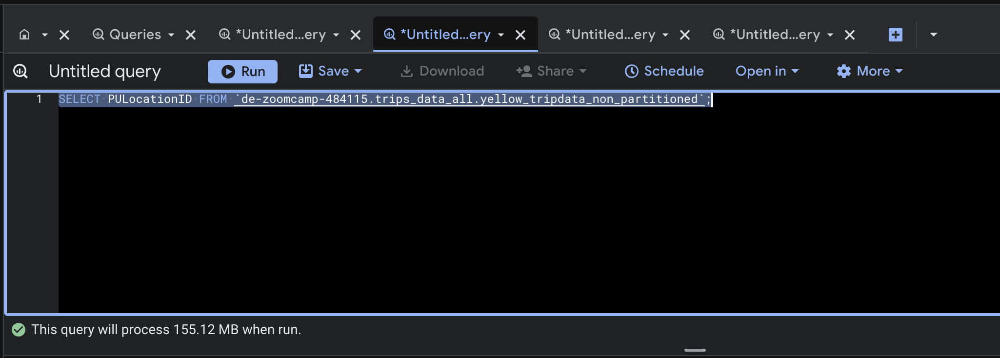
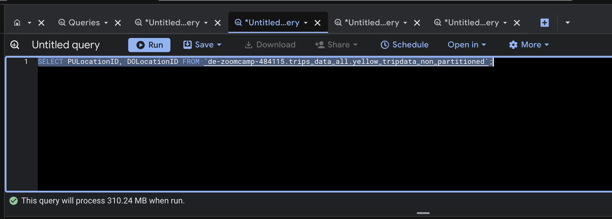

# Data Engineering Zoomcamp 2026 - Week 3: Data Warehouse (BigQuery)

This folder contains the homework solutions for Week 3, focusing on **Data Warehousing** using **Google BigQuery** and **Google Cloud Storage (GCS)**.

## Project Structure

| Path       | Description                                         |
| :--------- | :-------------------------------------------------- |
| `scripts/` | Python scripts for data ingestion into GCS.         |
| `images/`  | Screenshots and supporting images for the homework. |

---

## Usage

### 1. Setup Infrastructure

To replicate the setup, ensure you have the following:

- A **GCS Bucket** created.
- A **Service Account** with `Storage Admin` and `BigQuery Admin` roles.
- The JSON key downloaded and the environment variable set:
  ```bash
  export GOOGLE_APPLICATION_CREDENTIALS="/path/to/your/service-account.json"
  ```

### 2. Data Ingestion

Run the Python script to upload **Yellow Taxi Parquet files** (Jan - June 2024) to GCS:

```bash
python scripts/upload_to_gcs.py
```

---

## Homework Solutions

### Question 1: Count of records for the 2024 Yellow Taxi Data

**Query:**

```sql
SELECT count(*) FROM `<project_id>.<dataset_name>.yellow_tripdata_non_partitioned`;
```

**Answer:** `20,332,093`

---

### Question 2: Estimated amount of data for External vs Materialized Table

**Screenshots:**

|         External Table          |         Materialized Table          |
| :-----------------------------: | :---------------------------------: |
|  |  |

**Answer:** `0 MB for the External Table and 155.12 MB for the Materialized Table`

---

### Question 3: Why is the estimated number of bytes different?

**Screenshots:**

|            Query 1             |            Query 2             |
| :----------------------------: | :----------------------------: |
|  |  |

**Answer:**
**BigQuery is a columnar database**, and it only scans the specific columns requested in the query. Querying two columns (`PULocationID`, `DOLocationID`) requires reading more data than querying one column (`PULocationID`), leading to a higher estimated number of bytes processed.

---

### Question 4: How many records have a fare_amount of 0?

**Query:**

```sql
SELECT count(*)
FROM `<project_id>.<dataset_name>.yellow_tripdata_non_partitioned`
WHERE fare_amount = 0;
```

**Answer:** `8,333`

---

### Question 5: Best strategy to make an optimized table

**Answer:** `Partition by tpep_dropoff_datetime and Cluster on VendorID`

---

### Question 6: Estimated bytes processed for Non-partitioned vs Partitioned table

**Query (Non-partitioned):**

```sql
SELECT DISTINCT(VendorID)
FROM `<project_id>.<dataset_name>.yellow_tripdata_non_partitioned`
WHERE tpep_dropoff_datetime BETWEEN '2024-03-01' AND '2024-03-15';
```

**Query (Partitioned & Clustered):**

```sql
SELECT DISTINCT(VendorID)
FROM `<project_id>.<dataset_name>.yellow_tripdata_partitioned_clustered`
WHERE tpep_dropoff_datetime BETWEEN '2024-03-01' AND '2024-03-15';
```

**Answer:** `310.24 MB for non-partitioned table and 26.84 MB for the partitioned table`

---

### Question 7: Where is the data stored in the External Table?

**Answer:** `GCP Bucket`

---

### Question 8: It is best practice in BigQuery to always cluster your data?

**Answer:** `False`

---

### Question 9: Why is the estimated bytes 0 when using count(\*)?

**Answer:**
The estimated bytes are zero because **BigQuery uses metadata** to answer global count queries. Since the total row count is already stored in the table's statistics, no data scanning is required unless a filter is applied.
